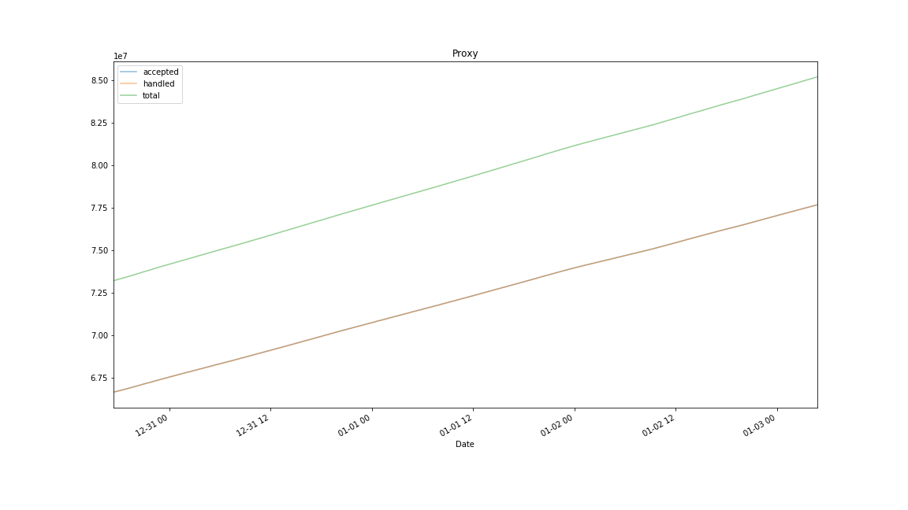
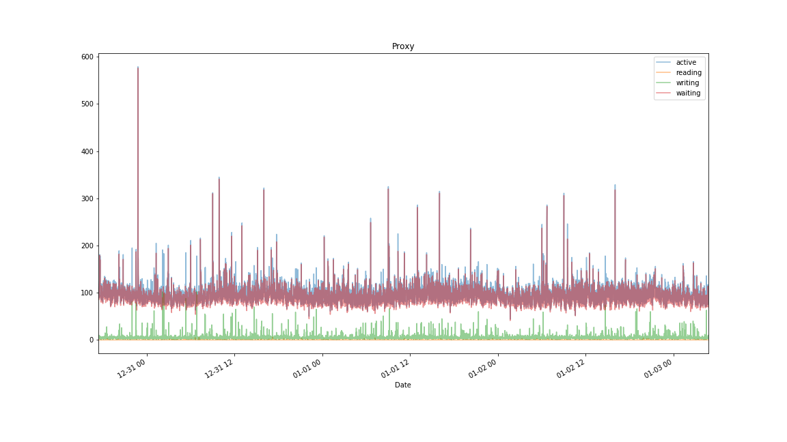
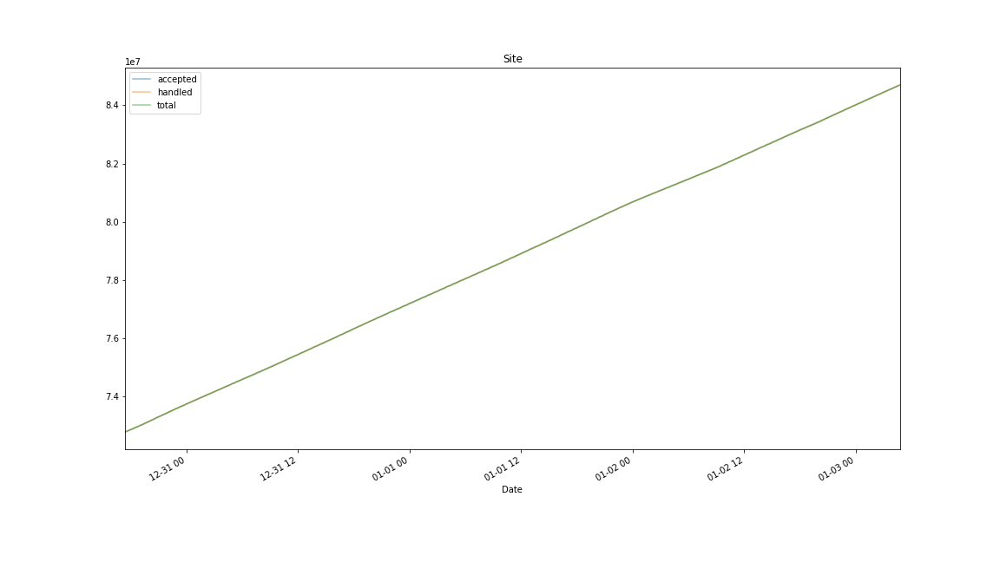
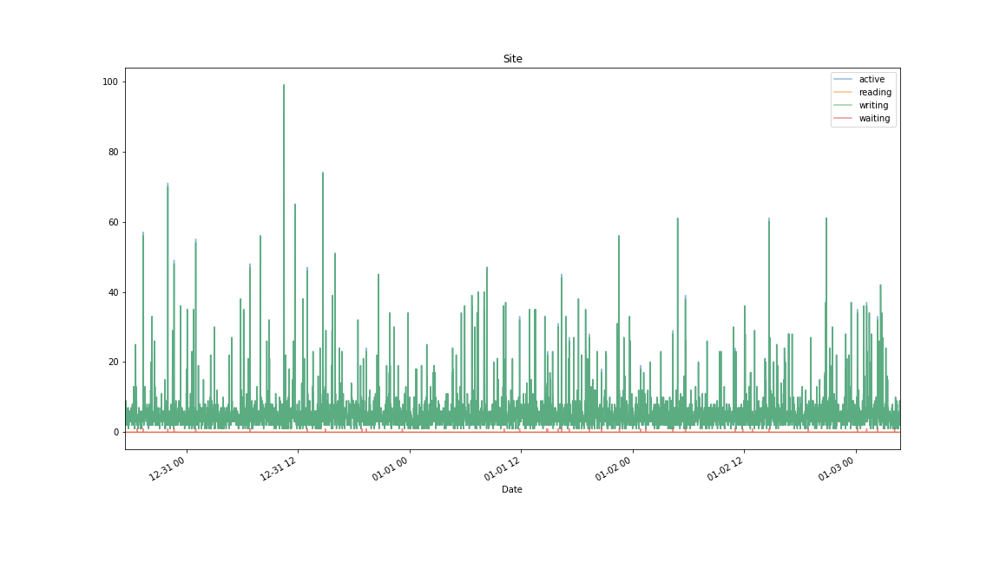
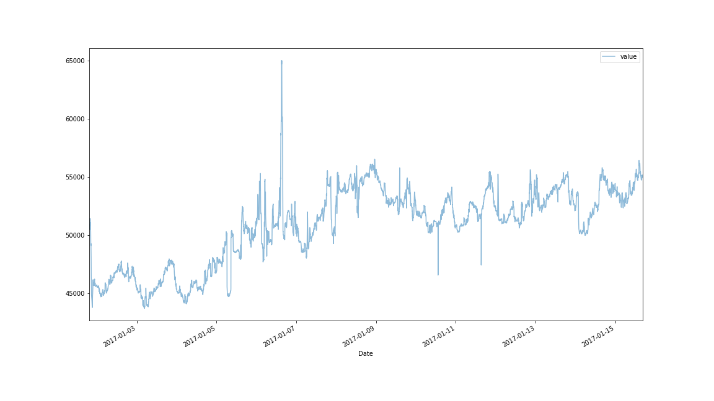

# TMB Statistics

A repository for summarising server statistics from [themixingbowl.org](https://themixingbowl.org).

Data is in the `data/` directory and a [Jupyter Notebook](https://jupyter.org) can be found under `notebooks/TMB Stats.ipynb` 
that reads in the data and produces the time-series plots below.

**NB** No data cleaning has been done, the UNIX timestamp (in seconds) is converted to a date/time and set as the 
index of the data frame and time-series plots are then generated.

# Webstats

## Proxy

## Site

# Peer Counts

# Response Time

